<h1 align="center">Urban Style</h1>

Una tienda web de ropa programada desde cero

<h2>📌 Descripción del proyecto</h2>

Este proyecto es una tienda de ropa creada desde cero en JSF, Java y XHTML. Fue el proyecto final de desarrollo de interfaces de mi segundo año, y esta creada siguiendo las bases más estrictas de modelo vista controlador. Cuenta también con un panel de administrador para modificar tanto clientes como ropa (con la privacidad asegurada y sin acceso a datos personales) y un sistema insignia que añade un descuento a los usuarios en base a cuantas compras acumulen

El proyecto fue creado con la idea de darle una vuelta de tuerca a las páginas tradicionales, añadiendo esa función de descuento para plantear una base de fans leal

Sus puntos fuertes son la arquitectura solida (dos proyectos, manager y tienda, ambos con cuatro proyectos internos), su profesionalidad y su pulidez

---

<h2>🛠️ Características principales</h2>

<ul>
  <li>Compra de ropa</li>
  <li>Categorías y colecciones</li>
  <li>Descuentos acumulativos por número de compras</li>
  <li>Creación y gestión de cuentas con login</li>
  <li>Privacidad de los datos, no visibles en el panel de administrador y contraseñas desordenadas en la base de datos local</li>
  <li>Control total sobre los productos, sus datos y los clientes</li>
  <li>Pulidez y escalabilidad</li>
</ul>

---

<h2>🖥️ Capturas de la aplicación</h2>

<h3>🔧 Nombre de pantalla 1</h3>
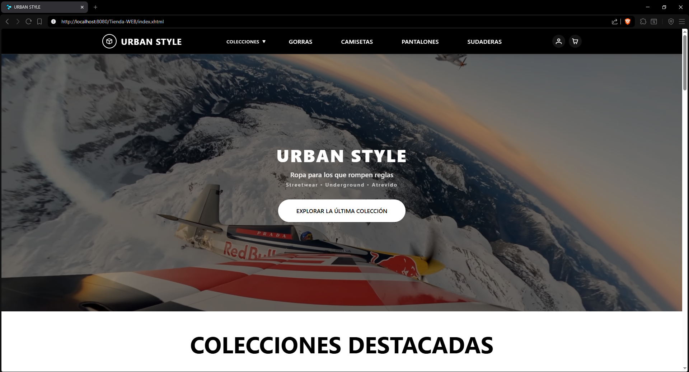

<h3>🔧 Nombre de pantalla 2</h3>
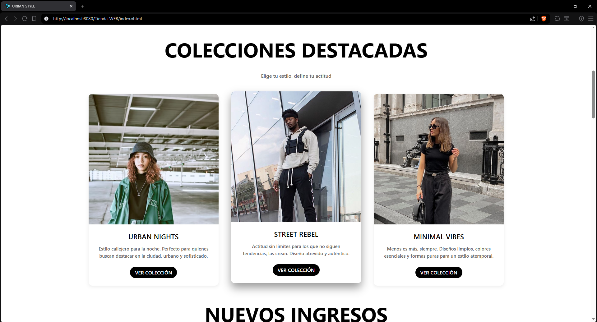

<h3>🔧 Nombre de pantalla 3</h3>
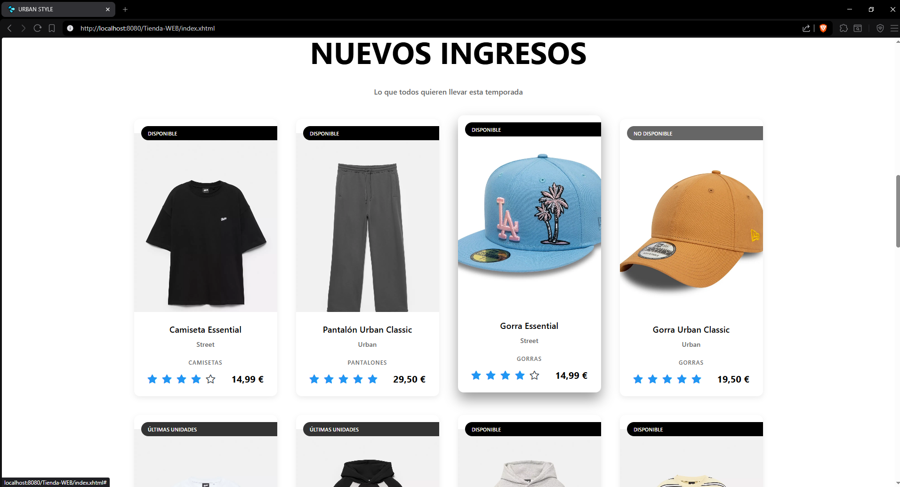

<h3>🔧 Nombre de pantalla 4</h3>
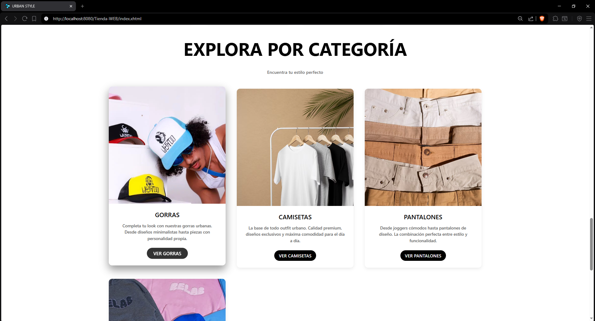

<h3>🔧 Nombre de pantalla 5</h3>
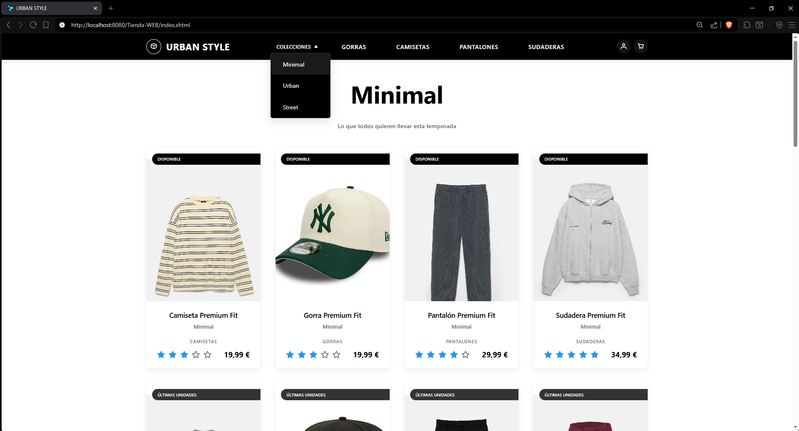

<h3>🔧 Nombre de pantalla 6</h3>
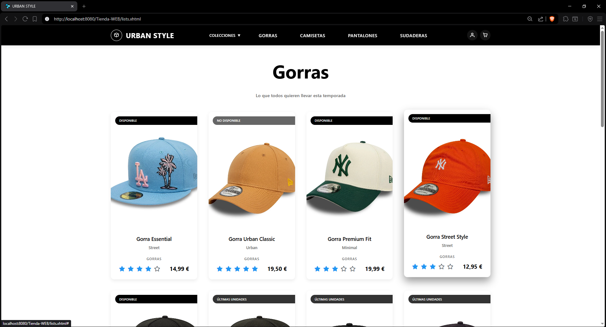

<h3>🔧 Nombre de pantalla 1</h3>
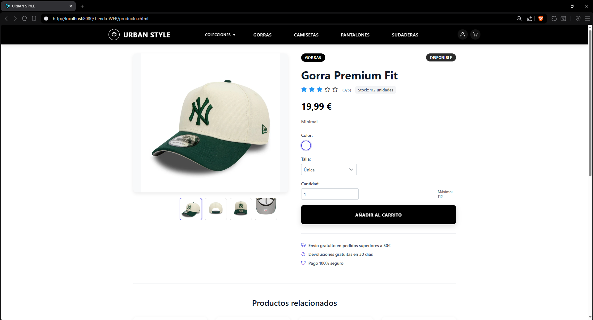

<h3>🔧 Nombre de pantalla 2</h3>
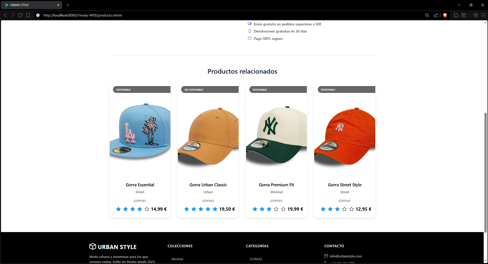

<h3>🔧 Nombre de pantalla 3</h3>
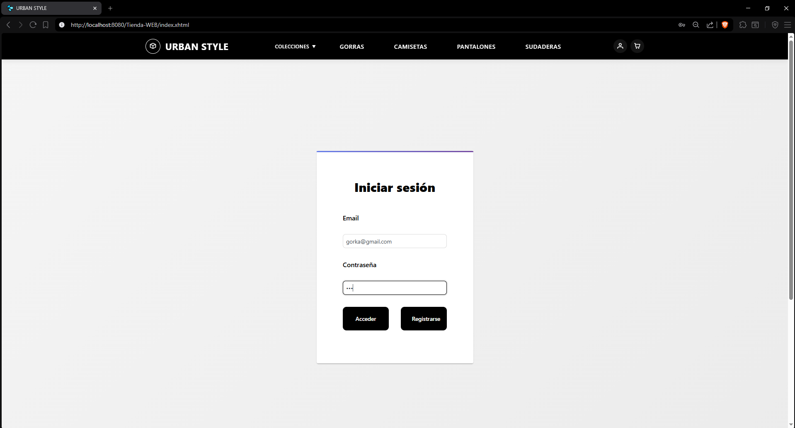

<h3>🔧 Nombre de pantalla 4</h3>
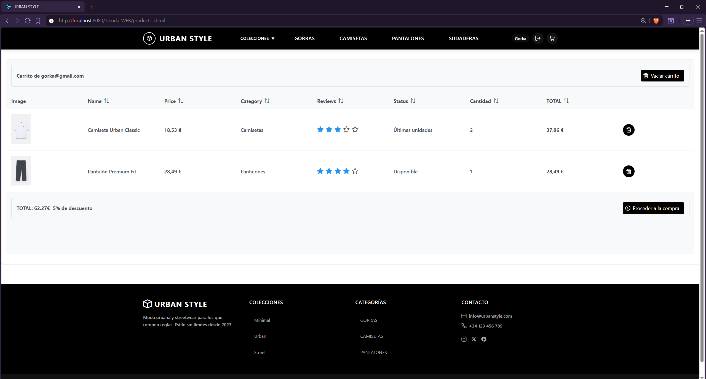

<h3>🔧 Nombre de pantalla 5</h3>
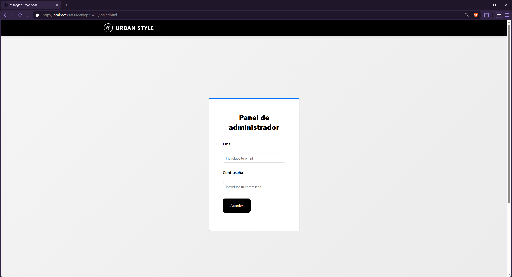

<h3>🔧 Nombre de pantalla 6</h3>
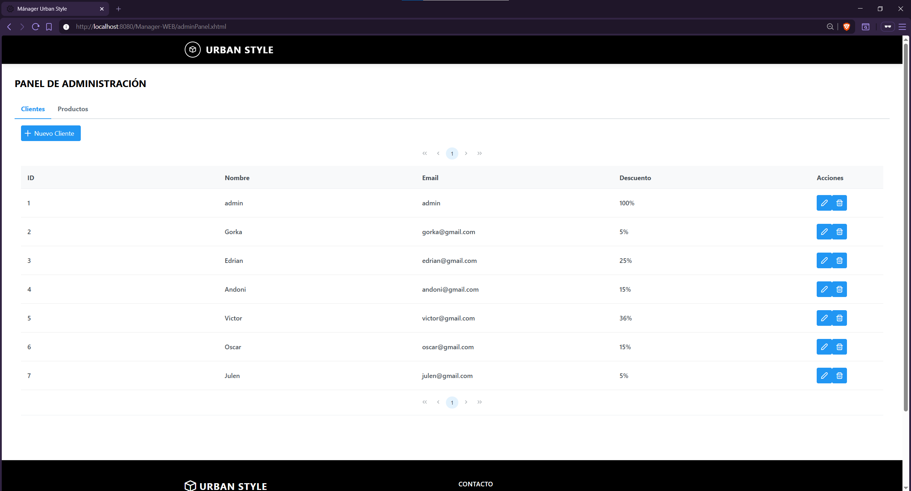

<h3>🔧 Nombre de pantalla 4</h3>
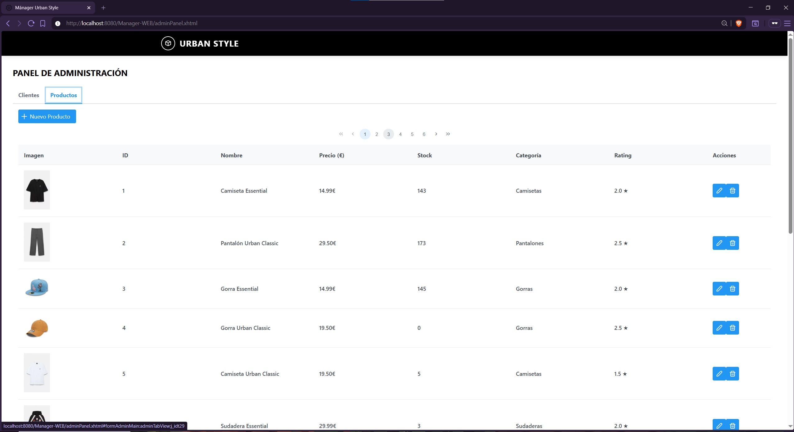

<h3>🔧 Nombre de pantalla 5</h3>
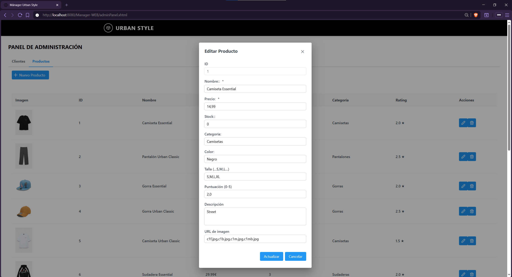

<h3>🔧 Nombre de pantalla 6</h3>
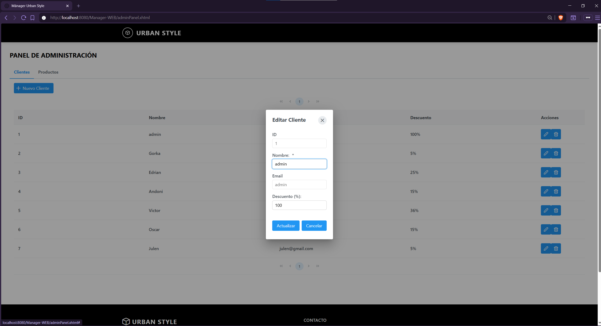

---

<h2>📊 Datos de prueba</h2>

<table>
  <tr>
    <th>Nombre</th>
    <th>Email</th>
    <th>Contraseña</th>
    <th>Descuento</th>
    <th>Compras</th>
  </tr>
  <tr>
    <td>admin</td>
    <td>admin</td>
    <td>admin123</td>
    <td>100</td>
    <td>0</td>
  </tr>
  <tr>
    <td>Gorka</td>
    <td>gorka@gmail.com</td>
    <td>123</td>
    <td>5</td>
    <td>15</td>
  </tr>
  <tr>
    <td>Edrian</td>
    <td>edrian@gmail.com</td>
    <td>123</td>
    <td>25</td>
    <td>10</td>
  </tr>
  <tr>
    <td>Andoni</td>
    <td>andoni@gmail.com</td>
    <td>123</td>
    <td>15</td>
    <td>5</td>
  </tr>
</table>

---

<h2>🚀 Tecnologías utilizadas</h2>

<ul>
  <li>Java</li>
  <li>JSF</li>
  <li>CSS</li>
  <li>Glassfish</li>
  <li>MySQL</li>
</ul>

---

<h2>📌 Notas adicionales</h2>

Este es el mayor proyecto de web que he hecho hasta la fecha, una tienda totalmente funcional. Con pocos arreglos podría ser lanzada y utilizada.

